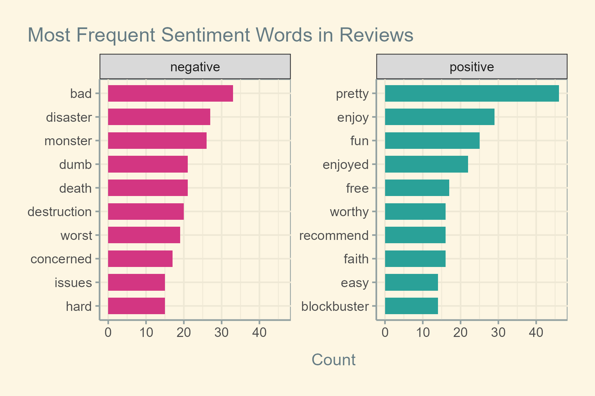

```{r setup, include=FALSE}
knitr::opts_chunk$set(echo = F, cache = T)
```

> Assignment: [reproducible research](https://cfss-macss.netlify.app/assignments/reproducible-research/)

# Overview
This project aims to look at the trends of environment-themed movies, scraping data from **The Movie Database API** - [TMDB](https://developer.themoviedb.org/docs). TMDB is crowd-sourced and has free API. Further, its documentation is easier to access than trying with IMDB, which is why I'm choosing TMDB.


I wanted to experiment with text analysis, specifically, sentiment analysis. However, the scraping took more more exhaustive work than expected. I am reducing the work in text analysis.

I will focus on origin countries China and US as these are the [largest CO2 emitters](https://www.worldometers.info/co2-emissions/co2-emissions-by-country/) in the world.

## Research questions
Because I scrape the data in this project, my goals are exploratory:  
1. Does environment-themed movies increase over time across countries? Any noticeable milestone? Which countries produce the most environmental movies?   
2. What are the trends of audience reception of environment movies?  
3. Based on sentiment analysis, what factors correlate with reception of these movies? Specifically, does negative themes like environmental crises impact reception? 

## Workflow & Repo instructions
The scraping and cleaning steps are comprehensively recorded in this [Rmarkdown file](environment_film_analysis.Rmd)). Important skills demonstrated in this project are explicit in the [scraping script](movie_info_by_id.R) and [text analysis script](text_analysis.R), including but not limited to:  
- functions  
- loops  
- conditional statements  
- reproducible workflows  
- transforming data  
- sentiment analysis  
- visualizations with `ggplot2`

**Summary**:  
1. Scrape the keywords adjacent to "environmentalism"  
2. Scrape movies matching keywords, including details such as user ratings, reviews, etc.  
3. Tidying data simultaneously with other processes  
4. Exploratory analysis and sentiment analysis   
5. Export images, data files  

**To reproduce the results**:   
- Follow the [Rmd file](environment_film_analysis.Rmd) section by section to scrape and tidy the data.  
- Basic summaries and exploratory visualizations should be run in the *Rmd* file. For [text analysis](#text-analysis), expect to head to [script](text_analysis.R) for analysis and visualizations.  
- Most exporting commands like `ggsave` are commented so they don't run on every export/call. You should un-comment them for exports.  
- After tidying data and adding useful variables, save the data by `write_csv` chunk at the end of *Rmd* document.   
* *Note that certain generated figures in [image folder](img/) are marked "0" as initial plots. These likely contain issues that later versions in the* Rmd *file or script correct. They are retained for revisiting purposes. You cannot generate those by using the current codes in this repo.*

## Set up
```{r libraries, cache = FALSE, message = FALSE, warning = FALSE, results='hide', echo=T}
# install if needed
# install.packages(c("jsonlite", "ggthemes", "patchwork", "rvest", "kableExtra"))

library(tidyverse)
library(stringr)
library(jsonlite)
library(httr)
library(ggthemes)
library(patchwork)
library(rvest)
library(lubridate)
library(scales)
library(kableExtra)
```
```{r viz-custom, cache = FALSE, message = FALSE, warning = FALSE, results='hide'}
# theme customization
theme_set(theme_solarized())
theme_update(
  plot.margin = margin(20, 20, 20, 20),
  axis.title.x = element_text(margin = margin(t = 10)),
  axis.title.y = element_text(margin = margin(r = 10)),
  plot.title.position = "plot"
)

# setting global color palettes
scale_colour_continuous <- scale_color_solarized
scale_colour_discrete <- scale_color_solarized
scale_colour_binned <- scale_color_solarized
scale_fill_discrete <- scale_fill_solarized
```

```{r load-data, echo=T, results='hide', warning=F, message=F}
top_keywords <- read_csv("data/selected_keywords_envir.csv")
movies_df <- read_csv("data/movies.csv")
reviews_df <- read_csv("data/reviews.csv")
```

```{r rscript-call, results='hide', message=F, warning=F}
source("movie_info_by_id.R")
source("text_analysis.R")
```

# Getting the data

## Making keyword list

I started with the keyword **"environmentalism"**. I made a list of all movies matching this keyword. Then I extracted all keywords of these movies and took the top 25 common keywords for manual selection.

```{r, dependson="rscript-call", eval=F}
envrism_id <- get_kw_id_by_kw("environmentalism")
envrism_movies <- get_all_pages(get_movies_by_kwid, key_id = envrism_id)

# get all keywords of environment movies
keywords_envi_movies <- lapply(envrism_movies$movie_id, function(id) {
  get_all_pages(get_keywords, movie_id = id)
})
keywords_df <- bind_rows(keywords_envi_movies)

top_keywords <- keywords_df %>% 
  group_by(keyword, key_id) %>% 
  count(sort = T) %>% 
  head(n = 25) %>% 
  select(keyword, key_id)

```

After looking the common keyword list with **"environmentalism"**, I filtered out some keywords that were too generic. For example, **"nature"** might be a film exploring the nature or having nature as a prominent backdrop. Below is the final list of selected keywords.

```{r finalizing-keywords, eval=F}
keyword_to_rm <- c("nature", "woman director", "activism", "short film", "ocean", "politics", "animal rights", "anime", "health")

top_keywords <- top_keywords[!top_keywords$keyword %in% keyword_to_rm, ]
```

```{r show-keywords, include=T}
top_keywords %>% select(keyword) %>% kable()
```

## Scraping data
### Get movie info

(hidden for brevity)

```{r general-movie-info, eval=F}
# get movies matching selected keywords
all_kw_movies <- lapply(top_keywords$key_id, function(id) {
  get_all_pages(get_movies_by_kwid, key_id = id)
})

# get unique movie IDs, the list to loop over later
all_movies_id <- bind_rows(all_kw_movies) %>% select(movie_id) %>% 
  distinct() %>% 
  pull(movie_id)
```

```{r get-movies-info, eval=F}
raw_movies_det <- lapply(all_movies_id, get_movie_details)

# origin_country types are character and list, this solves inconsistency to perform bind_rows()
all_movies_df <- lapply(raw_movies_det, function(df) {
  if (!"origin_country" %in% names(df)) {
    df$origin_country <- NA_character_
  } else if (is.list(df$origin_country)) {
    country <- df$origin_country
    # Some are list( character vector ), some list(NULL)
    if (length(country) > 0 && length(country[[1]]) > 0) {
      df$origin_country <- paste(unlist(country), collapse = ", ")
    } else {
      df$origin_country <- NA_character_
    }
  } else if (is.null(df$origin_country)) {
    df$origin_country <- NA_character_
  }
  df
}) %>% 
  bind_rows() %>% 
  select(-origin_country) %>%
  # because origin_country only lists the country of production companies, not production countries
  # I realized this after bind_rows
  # separate rows for easier plotting of countries
  separate_rows(production_countries, sep = ",\\s*") %>% 
  drop_na(production_countries)

# remove duplicates
movies_df <- all_movies_df %>% distinct(.keep_all = T) 
```

### Tidying & handling missing values
```{r date-handling, eval=F}
# date handling
movies_df$release_date <- ymd(movies_df$release_date)

movies_df <- movies_df %>% 
  mutate(year = year(release_date), .before = release_date) %>% 
  drop_na(year) %>%  
  # explicitly shows NA
  mutate(across(where(is.character), \(x) na_if(x, c("")))) %>% 
  mutate(across(where(is.numeric), \(x) na_if(x, 0)))
```
After tidying movie data, we obtain the [dataset](data/movies.csv) with the variables below.

```{r show-movies, include=T, results='asis'}
# glimpse(movies_df)
names(movies_df)
```

### Get reviews of movies

```{r request-and-tidy-reviews, eval=F}
raw_reviews <- lapply(all_movies_id, function(id) {
  get_all_pages(get_reviews, movie_id = id)
})

# join with all movies ID to show NAs
reviews_df <- raw_reviews %>% bind_rows() %>% select(c(id, results.content)) %>% 
  full_join(tibble(all_movies_id), by = join_by(id == all_movies_id)) %>% 
  rename(review = results.content)
```

We obtain the reviews data, matching with the movie dataset by [movie_id](https://developer.themoviedb.org/reference/movie-details) assigned by TMDB. 

```{r glimpse-reviews, results='hide'}
glimpse(reviews_df) 
```

The total number of reviews extracted is not huge, only `r reviews_df %>% filter(!is.na(review)) %>% count() %>% pull(n)`. This may lead to large frequency of distinctive names used in movies (e.g. Godzilla - more details in [text analysis](#text-analysis)).  

# Analysis

## Frequency of movies released
```{r, eval=F}
p_time_total <- movies_distinct %>% count(year) %>% 
  ggplot(aes(x = year, y = n)) +
  geom_col(width = 0.7) + 
  scale_x_continuous(n.breaks = 8) +
  labs(
    x = "Year",
    y = "Movies per year",
    title = "Environment movies released over time",
    caption = "Source: TMDB"
  )
ggsave(filename = "img/time_movies.png", plot = p_time_total, width = 8, height = 4.5)  
```


Environmental movies increase over time. 2025 movies are fewer because the data is scraped on `r make_date(2025, 7, 17)`. Although we are in the latter half of the year and the number of environment movies are lower than half those released last year, I refrained from interpretation as this might be a delay of the database and movie releases may not be linear across all months.

```{r display-countries-time-series, eval=F}
# summary with relative proportions
count_countries <- movies_df %>%
  filter(!is.na(production_countries)) %>%
  mutate(
    highlight_country = ifelse(
      production_countries %in% c("China", "United States of America"),
      production_countries, "Other"
    )) 
count_countries$highlight_country <- factor(count_countries$highlight_country,
                                            levels = c("China",
                                                       "United States of America",
                                                       "Other"))

p_countries_area <- count_countries %>%
  count(year, highlight_country, sort = TRUE) %>% 
  ggplot(aes(x = year, y = n, fill = highlight_country)) +
  geom_area(position = "fill") +
  scale_y_continuous(labels = label_percent()) +
  scale_fill_manual(values = c(
    "China" = "firebrick",
    "United States of America" = "darkblue",
    "Other" = "darkgray"
  )) +
  labs(
    x = "Year",
    y = "Proportion of movies"
  ) + 
  labs(fill = "Countries")


p_countries_line <- count_countries %>% 
  group_by(production_countries, year, highlight_country) %>% 
  count(name = "num", sort = T) %>% 
  ggplot(aes(x = year, y = num, group = production_countries, color = highlight_country)) +
  geom_point(size = 1, alpha = 0.6) +
  geom_line() +
  scale_color_manual(values = c(
    "Other" = "darkgray",
    "China" = "firebrick",
    "United States of America" = "darkblue"
  )) +
  labs(
    title = "Amount of movies released by origin country over time",, 
    subtitle = "Excluding movies with missing origin countries",
    x = "Year",
    y = "Number of movies made"
  ) + 
  guides(color = "none")

p_countries <- p_countries_line + p_countries_area + plot_layout(
  axis_titles = "collect", guides = "collect", axes = "collect") &
  theme(legend.position = 'bottom')

ggsave(filename = "img/time_countries.png", plot = p_countries, width = 8, height = 4.5)
```


The US has consistently dominated production of environmental movies, whereas China's number was limited. Part of the reason may be that the source of this dataset, TMDB, is an English-based crowdsourcing database This figure shows the total of movies by countries, and unlike the histogram above, contains duplicates where multiple countries co-produces movies.

I cut the release data data into 3 intervals with equal number of movies in each period. Looking at the intervals, it is clear that more environmental movies are being released, making more recent periods *shrink*, as in `r period_lvl`.

```{r cut-interval}
movies_df <- movies_df %>% mutate(year = as.numeric(year)) %>% mutate(period = cut_number(year, n = 3), .after = year)

movies_df$period <- factor(movies_df$period, levels = period_lvl) # period lvl from script file 

movies_distinct <- movies_df %>% distinct(id, .keep_all = T)
movies_distinct$period <- factor(movies_distinct$period, levels = period_lvl)
```

## Reception
```{r time-vote, eval=F}
p_time_vote <- movies_distinct %>% filter(!is.na(vote_average)) %>% 
  ggplot(aes(y = vote_average, fill = period)) +
  geom_boxplot(staplewidth = 0.1, outliers = F) +
  labs(
    title = "User ratings of environment movies over time",
    y = "Average rating of movie",
    fill = "Period",
    caption = "Source: TMDB"
  ) +
  theme(axis.text.x = element_blank())
ggsave(filename = "img/time_vote.png", plot = p_time_vote, width = 8, height = 4.5)
```


There doesn't seem to be very significant changes in the distribution of ratings over time. Overall, ratings of environmental movies rise, which might be an indicator for increasing positive reception of environmental movies. Can time be a confounding variable? It doesn't seem like so -- supporting increased appreciation of environmental movies, a movie analysis  [project](https://surajkarak.github.io/projects/IMDb-Movie-Data-Analysis/#:~:text=Exploring%20the%20weightedRating%20averaged%20for%20all%20films%20in%20a%20year%2C%20it%20looks%20like%20the%20decade%201920s%2D1930s%20was%20the%20best) of IMDb suggests that overall weighted ratings of movies do not rise over time but decline.

```{r rating-revenues, eval=F}
p_time_rating_revenue <- movies_distinct %>%  
  filter(!is.na(revenue) & !is.na(vote_average)) %>% 
  ggplot(aes(x = revenue / (10**6), y = vote_average, color = period, shape = period)) +
  geom_point(size = 1.5) +
  scale_x_continuous(n.breaks = 5) +
  labs(
    title = "User ratings and revenues of environment movies over time",
    x = "Revenue (million USD)",
    y = "Average rating",
    color = "Period", shape = "Period",
    caption = "Source: TMDB"
  ) +
  guides(size = "none")
ggsave(filename = "img/time_vote_revenue.png", plot = p_time_rating_revenue, width = 6, height = 3)
```


The revenue of movies does not show an upward trend over different periods. There is no clear emerging preference for environment movies regarding box offices. 

## Text analysis
### Frequent words
The [initial plot](img/most_frequent_period_0.png) shows "movie" and "film" at the top. This is very unhelpful. I modified the code in [script](text_analysis.R) to filter them out.


In the first period, environmental movies seem to center around nature ("nature", "earth", "disaster") and human ("people", "humanity", "human"). *"klaatu"* is a humanoid alien character in movie [Klaatu](https://en.wikipedia.org/wiki/Klaatu(The_Day_the_Earth_Stood_Still)).  Moving to the second period, the theme changes quite drastically towards monsters ("godzilla", "monsters", "titans"). This period (2013-2020) marks the success of Godzilla[^godzilla-note] as its frequency rises higher than any token across all periods. Lastly, from 2020 to present as of 2025, "science" enters the chart for the first time. This might indicate growing awareness towards climate science in recent years.

Notably, "time" tops both 1950-2013 and 2020-2025 and is also common in reviews in the 2013-2020 period. However, when I looked into it for context, "time" has been used in non-evaluative ways, mostly irrelevant to the sentiment of the reviews and content of the movies. Some examples are shown below:
```{r time-token}
reviews_sentences_split <- reviews_df %>% separate_longer_delim(review, "\n") %>% separate_longer_delim(review, ". ")
reviews_sentences_split %>% filter(str_detect(review, "time")) %>% select(review) %>% head() %>% kable()
```
### Sentiment analysis
Sentiment analysis is performed in [script](text_analysis.R).  



In the early period (1950-2013), it seems that discussion centers around nature more than human in terms of natural disasters and beauty. Similar to the frequency plot, the theme monster and apocalypse disappears in the last period. "protest" entry in this last period may imply a shift towards anthropogenic climate change, where human becomes more actively involved in climate issues. "faith" and "optimism" entries in positive charts during 2013-2025 are in accordance with this.


For user ratings and sentiment scores (graph below), in the recent period of 2013-2025, higher ratings seem to go hand in hand with positive sentiment scores. The trend is in accordance with the high-frequency positive words shown in previous figures. This pattern is inconsistent with the 1950-2013 period, where the highest rating bin has a negative mean sentiment score. This can be attributed to the fact that high-frequency negative words from 1950 to 2013 are more descriptive than evaluative, and thus negative sentiment scores represent the movies' content rather than quality. Specifically, during 2013-2025, top negative words feature "bad", "dumb", "worst", "unnecessary", "stupid", "poorly", whereas 1950-2013 words include "destruction", "destructive", killing", "cold". There are mixes of descriptive and evaluative negative words across periods, but the distributions are not identical. 


There aren't clear patterns between the sentiment scores of movies and their success at box office. This supports the hypothesis that negative sentiments might characterize the content of environmental movies (e.g. climate crises) rather than indicate negative reception, especially in the old days (1950-2013).  


# Conclusion
Environment-themed movies are increasing over time. China's movies are very limited, whereas the US produced the most environmental movies. Based on user ratings, environmental movies have gained more positive reception over time -- but not increased success at box office. Some nuanced shifts in the content of environmental crises in movies are discussed in [sentiment analysis](#sentiment-analysis). Negative themes portrayed in movies did not lead to negative reception, particularly during 1950-2013. 

# Limitations & Directions
- Lack of data: Because TMDB is crowd-sourced, there are many movies missing reviews, revenues, ratings, etc. Movies that do not reach the global audience and/or are unavailable in English also are less likely to show up in the database and get scraped. Bigger database like IMDb is a better option than TMDB for scraping user ratings and reviews.   
- Time: 
  - I tried to find data on climate risk by countries to see whether environmental movies are being produced more/received better in countries heavily hit by climate change. However, I only found a [working paper](https://www.eib.org/attachments/lucalli/20250135-120625-economics-working-paper-2025-06-en.pdf) and a [2022 report](https://www.eib.org/attachments/lucalli/20250135-120625-economics-working-paper-2025-06-en.pdf), both of which are PDFs. I am uncertain about the reliability of this data, and also don't have time to scrape PDF data.  
  - Another direction I wanted to look into but not have time for is significant global climate milestones like Kyoto Protocol and Paris Agreement. Do they have any relationship with the environmental movies output?

# Resource/AI statement
- ChatGPT use to help with scraping and cleaning ([log](ai_log/api_scraping.html))   
- Extensive use of R packages documentation  
- Solarized palette [accents](https://ethanschoonover.com/solarized/) change so that color codes are distinctive   
- [Text mining with R](https://www.tidytextmining.com/) helps a lot with sentiment analysis and word frequency - e.g. [finding context of high-frequency word](https://www.tidytextmining.com/tfidf.html?q=bind#a-corpus-of-physics-texts)  
- Reference to the CFSS-MACSS text analysis fundamentals and web API R projects  
- [Chunk options](https://yihui.org/knitr/options/)  
- Many tips from the [graphics cookbook](https://r-graphics.org/RECIPE-BAR-GRAPH-LABELS.html)  

---
**Project reflections**: Making the project self-contained and reproducible would benefit from more practice. I struggled a lot with making decisions to maximize export speed and efficiency, manage environment objects, and connect all files together. Second, formulating my own research questions and getting the data for the project are recursive and time-consuming processes. I would not say what I did is incredibly difficult and complex, but there is some difficulty in being aware of what is going on in the data all the time -- e.g. when rows with NAs (which NAs?) stay and otherwise. A neurobiology class research project taught me research was recursive, exhausting, and (likely) rewardingly insightful. I think it applies for this final assignment.

[^godzilla-note]: Is Godzilla environmental? 
A 2019 [Godzilla movie](https://www.themoviedb.org/movie/373571) in the franchise was categorized as "eco terrorism", the message being destruction by some non-human species against human. I think it represents the fight back against anthropogenic climate issues, like human life is being threatened the way we have threatened others. There are also older movies in the dataset coming from the franchise like [Godzilla vs. Hedorah](https://www.themoviedb.org/movie/39464) (1971), which is very much environmental theme:  
> An ever evolving alien life-form arrives on a comet from the Dark Gaseous Nebula and proceeds to consume pollution. Spewing mists of sulfuric acid and corrosive sludge, neither humanity nor Godzilla may be able to defeat this toxic menace.


```{r export-data, eval=F}
write_csv(top_keywords, "data/selected_keywords_envir.csv")
write_csv(movies_df, "data/movies.csv")
write_csv(reviews_df, "data/reviews.csv")
```

```{r render, eval=F}
rmarkdown::render("environment_film_analysis.Rmd", output_format = "html_document", output_file = "report_env_movies.html")
rmarkdown::render("environment_film_analysis.Rmd", output_format = "md_document", output_file = "README.md")
```
