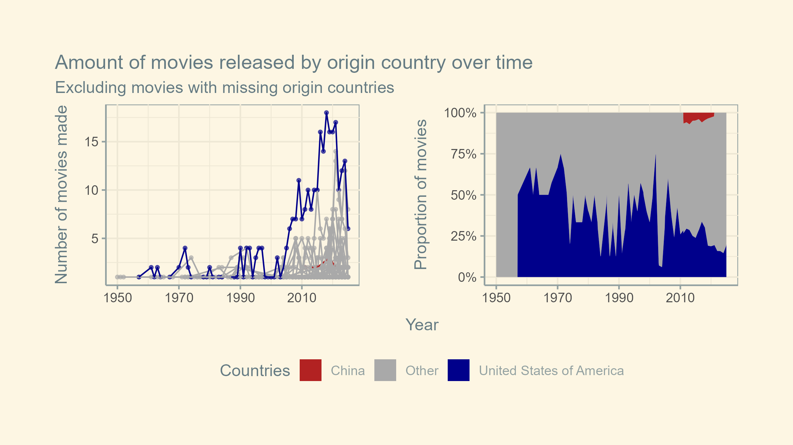
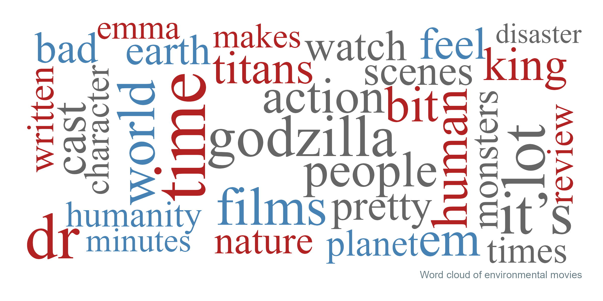
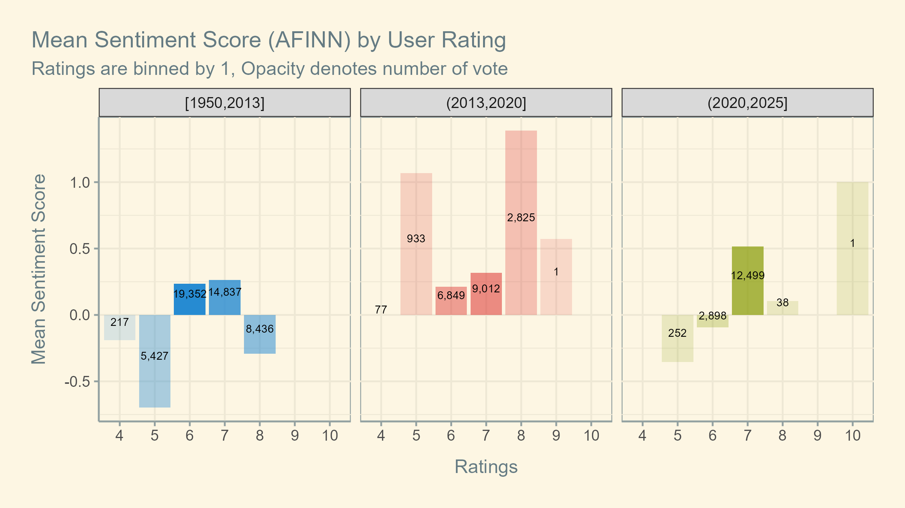
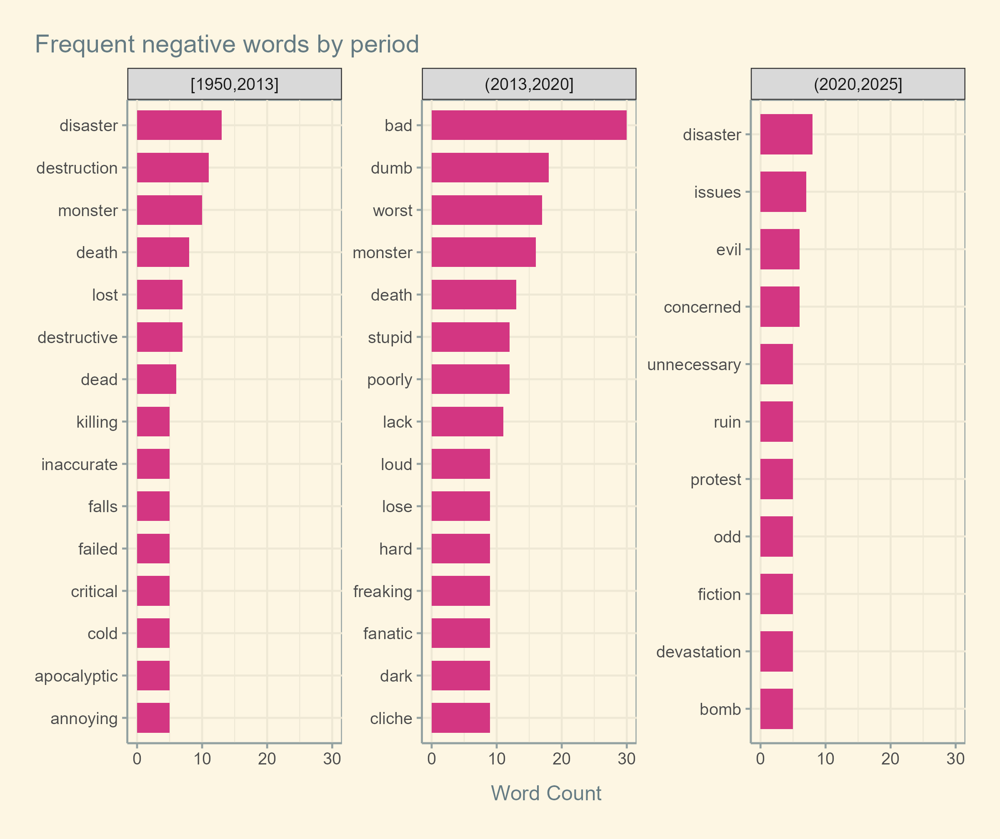
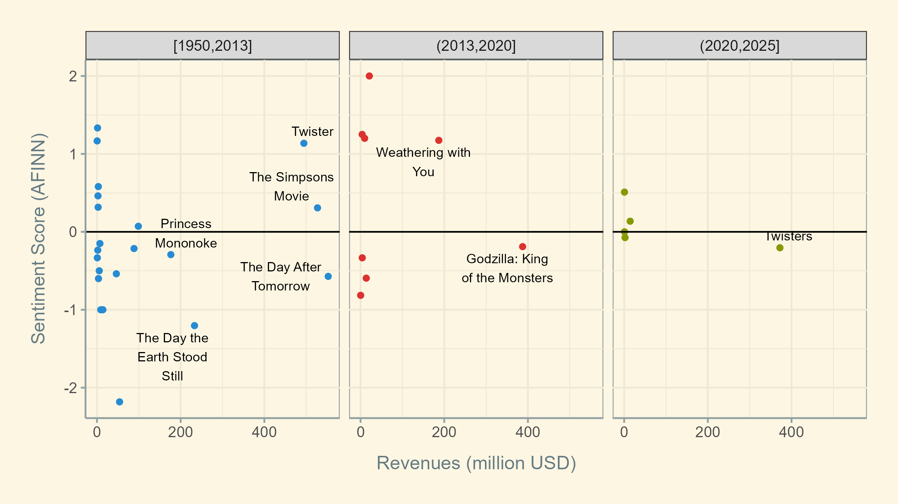

```{r xaringan-themer, include=FALSE, warning=FALSE}
library(xaringanthemer)
style_solarized_light(
  text_font_size = "0.8em",
  style_extra_css(
  css = list(
    # Reduce spacing after headings
    "h1, h2, h3, h4, h5, h6" = list("margin-bottom" = "0.2em"),
    # Increase spacing after paragraphs
    "li" = list("margin-bottom" = "0.7em")
  )
  )
)
```
## Questions

1. How has film production evolved regarding environmental themes?  
  
2. Which countries are most prominent in producing these films?
  
3. What can we infer about the *global environmental discourse through cinema*?

--

## Data & Methods
- Source: Scraping from TMDB - The Movie Database  
  
- Dataset: film reviews and metadata (years, countries, keywords, genres)  


---

# Frequency of movies released


???
Environmental movies increase over time. 2025 movies are fewer because the data is scraped on `r lubridate::make_date(2025, 7, 17)`. Although we are in the latter half of the year and the number of environment movies are lower than half those released last year, I refrained from interpretation as this might be a delay of the database and movie releases may not be linear across all months.

---

# Movie releases by countries 


???
The US has consistently dominated production of environmental movies, whereas China's number was limited. Part of the reason may be that the source of this dataset, TMDB, is an English-based crowdsourcing database This figure shows the total of movies by countries, and unlike the histogram above, contains duplicates where multiple countries co-produces movies.


I cut the release data data into 3 intervals with equal number of movies in each period. Looking at the intervals, it is clear that more environmental movies are being released, making more recent periods *shrink*, as in [1950,2013], (2013,2020], (2020,2025].

---
# Reception: Ratings


???
There doesn't seem to be very significant changes in the distribution of ratings over time. Overall, ratings of environmental movies rise, which might be an indicator for increasing positive reception of environmental movies. Can time be a confounding variable? It doesn't seem like so -- supporting increased appreciation of environmental movies, a movie analysis  [project](https://surajkarak.github.io/projects/IMDb-Movie-Data-Analysis/#:~:text=Exploring%20the%20weightedRating%20averaged%20for%20all%20films%20in%20a%20year%2C%20it%20looks%20like%20the%20decade%201920s%2D1930s%20was%20the%20best) of IMDb suggests that overall weighted ratings of movies do not rise over time but decline.

---
# Reception: Revenue

--
The revenue of movies does not show an upward trend over different periods. There is no clear emerging preference for environment movies regarding box offices. 

---
class: inverse, middle, center

# Text analysis


---
# Frequent words


???
In the first period, environmental movies seem to center around nature ("nature", "earth", "disaster") and human ("people", "humanity", "human"). *"klaatu"* is a humanoid alien character in movie [Klaatu](https://en.wikipedia.org/wiki/Klaatu(The_Day_the_Earth_Stood_Still)).  Moving to the second period, the theme changes quite drastically towards monsters ("godzilla", "monsters", "titans"). This period (2013-2020) marks the success of Godzilla[^godzilla-note] as its frequency rises higher than any token across all periods. Lastly, from 2020 to present as of 2025, "science" enters the chart for the first time. This might indicate growing awareness towards climate science in recent years.

Notably, "time" tops both 1950-2013 and 2020-2025 and is also common in reviews in the 2013-2020 period. However, when I looked into it for context, "time" has been used in non-evaluative ways, mostly irrelevant to the sentiment of the reviews and content of the movies. Some examples are shown below:

# Sentiment by frequency

Essentially, analysis based on whether words are positive or negative.


???
In the early period (1950-2013), it seems that discussion centers around nature more than human in terms of natural disasters and beauty. Similar to the frequency plot, the theme monster and apocalypse disappears in the last period. "protest" entry in this last period may imply a shift towards anthropogenic climate change, where human becomes more actively involved in climate issues. "faith" and "optimism" entries in positive charts during 2013-2025 are in accordance with this.

---
# Sentiment & Ratings


???

- In the recent period of 2013-2025, higher ratings seem to go hand in hand with positive sentiment scores. The trend is in accordance with the high-frequency positive words shown in previous figures.  
- This pattern is inconsistent with the 1950-2013 period, where the highest rating bin has a negative mean sentiment score.


This can be attributed to the fact that high-frequency negative words from 1950 to 2013 are more descriptive than evaluative, and thus negative sentiment scores represent the movies' content rather than quality. Specifically, during 2013-2025, top negative words feature "bad", "dumb", "worst", "unnecessary", "stupid", "poorly", whereas 1950-2013 words include "destruction", "destructive", killing", "cold". There are mixes of descriptive and evaluative negative words across periods, but the distributions are not identical. 

---
# 


---
# Sentiment & Revenue


--
There aren't clear patterns between the sentiment scores of movies and their success at box office. Negative sentiments might characterize the content of environmental movies (e.g. climate crises) rather than indicate negative reception, especially in the old days (1950-2013).  

---

# Conclusion
- Environment-themed movies are increasing over time.  

--
- China's movies are very limited, whereas the US produced the most environmental movies. *Might be bias with the data.*  
  
--
- Based on user ratings, environmental movies have gained more positive reception over time, but not increased success at box office.  
  
--
- Some nuanced shifts in the content of environmental crises in movies are discussed in [sentiment analysis](#sentiment-analysis). Negative themes portrayed in movies did not lead to negative reception, particularly during 1950-2013.  
  
---

# Limitations & Directions
- Lack of data: Because TMDB is crowd-sourced, there are many movies missing reviews, revenues, ratings, etc. Movies that do not reach the global audience and/or are unavailable in English also are less likely to show up in the database and get scraped. Bigger database like IMDb is a better option than TMDB for scraping user ratings and reviews.   

- Time: 
  - I tried to find data on climate risk by countries to see whether environmental movies are being produced more/received better in countries heavily hit by climate change. However, I only found a [working paper](https://www.eib.org/attachments/lucalli/20250135-120625-economics-working-paper-2025-06-en.pdf) and a [2022 report](https://www.eib.org/attachments/lucalli/20250135-120625-economics-working-paper-2025-06-en.pdf), both of which are PDFs. I am uncertain about the reliability of this data, and also don't have time to scrape PDF data.  
  - Another direction I wanted to look into but not have time for is significant global climate milestones like Kyoto Protocol and Paris Agreement. Do they have any relationship with the environmental movies output?

---
class: center, middle

# Thanks!
Credits stolen from [xaringan intro slides](https://slides.yihui.org/xaringan/#1).

Slides created via the R package [xaringan](https://github.com/yihui/xaringan).

The chakra comes from [remark.js](https://remarkjs.com), [knitr](https://yihui.org/knitr/), and [R Markdown](https://rmarkdown.rstudio.com).